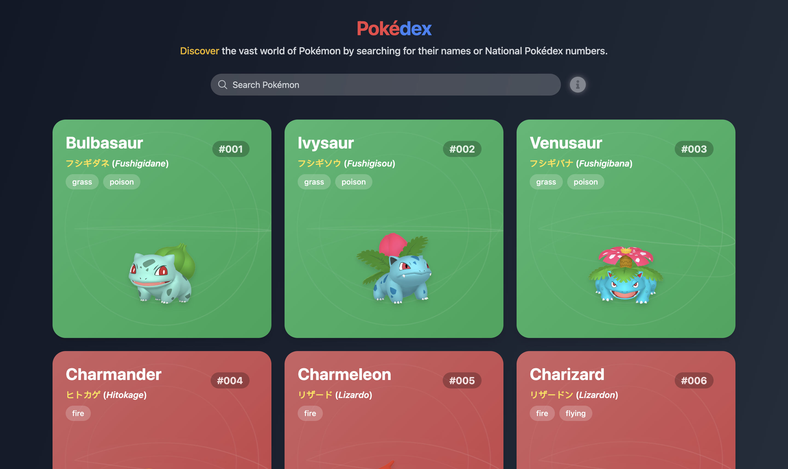

# Pokédex React App

A modern, responsive Pokédex application built with React, Vite, and Tailwind CSS. This app fetches data from the PokeAPI to display detailed information about Pokémon.

<p align="center">
  
</p>

## Features

- Display a list of Pokémon with infinite scrolling
- Search functionality to find specific Pokémon
- Detailed view for each Pokémon including:
  - Basic information (name, number, types)
  - Stats (HP, Attack, Defense, etc.)
  - Evolution chain
  - Moves
  - Habitat and other characteristics
- Responsive design that works on desktop and mobile devices
- Smooth animations and transitions using Framer Motion

## Technologies Used

- React
- Vite
- Tailwind CSS
- Framer Motion
- Ant Design
- PokeAPI
- Lodash
- React-router-dom
- React-icons

## Getting Started

### Prerequisites

- Node.js (v14 or later)
- npm or yarn

### Installation

1. Clone the repository:
   ```
   git clone https://github.com/melvinSunday/Pokedex.git
   ```

2. Navigate to the project directory:
   ```
   cd pokedex-react-app
   ```

3. Install dependencies:
   ```
   npm install
   ```
   or
   ```
   yarn install
   ```

4. Start the development server:
   ```
   npm run dev
   ```

5. Open your browser and visit `http://localhost:5173` to see the app running.

## Project Structure

```
src/
├── components/
│   ├── CardBack.jsx
│   ├── Context/
│   │   └── Context.jsx
│   ├── FetchPokemons.jsx
│   ├── LoadingSkeleton.jsx
│   ├── MainPage.jsx
│   ├── Pokemons.jsx
│   └── PokemonCard.jsx
├── App.jsx
├── main.jsx
└── index.css
```

## Contributing

Contributions are welcome! Please feel free to submit a Pull Request.

## License

This project is open source and available under the [MIT License](LICENSE).

## Acknowledgements

- [PokeAPI](https://pokeapi.co/) for providing the Pokémon data
- [Vite](https://vitejs.dev/) for the fast development environment
- [Tailwind CSS](https://tailwindcss.com/) for the utility-first CSS framework
- [Framer Motion](https://www.framer.com/motion/) for the animation library
- [Ant Design](https://ant.design/) for UI components

